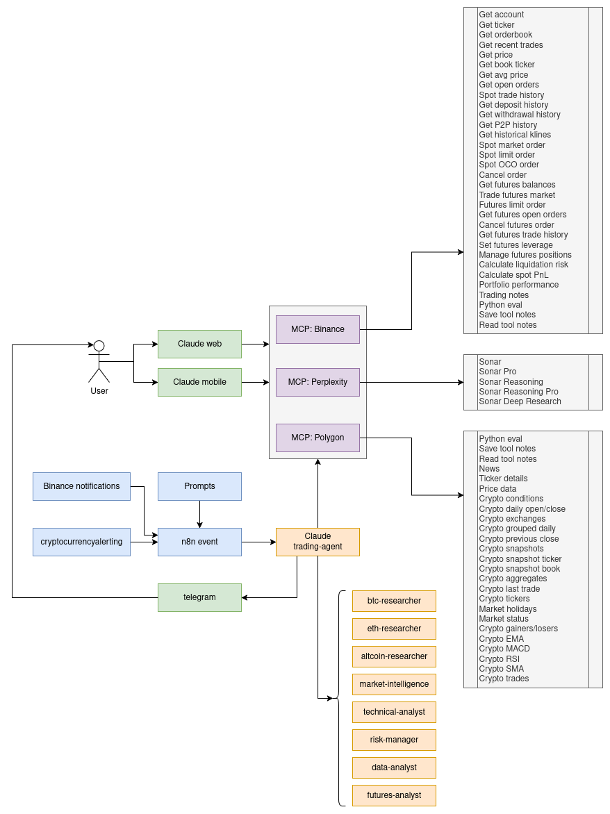
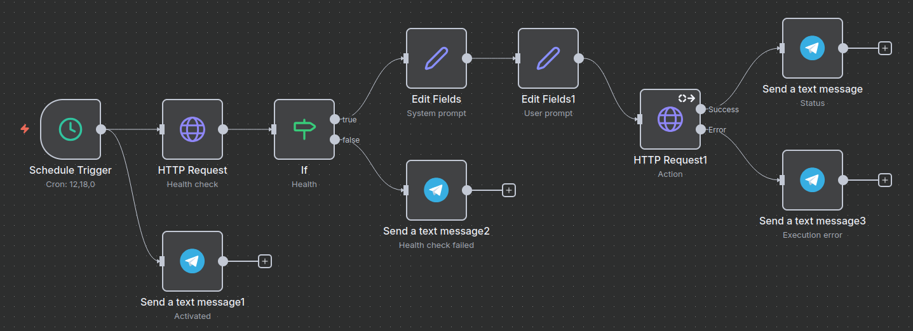
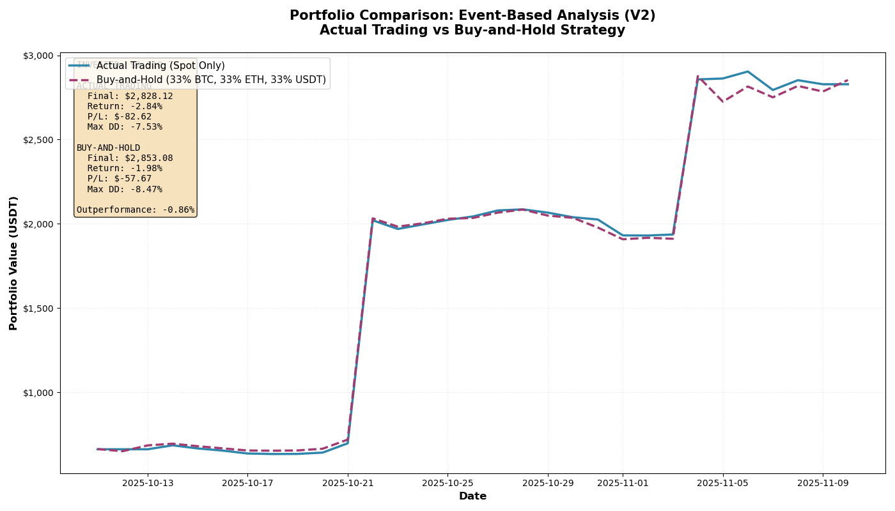
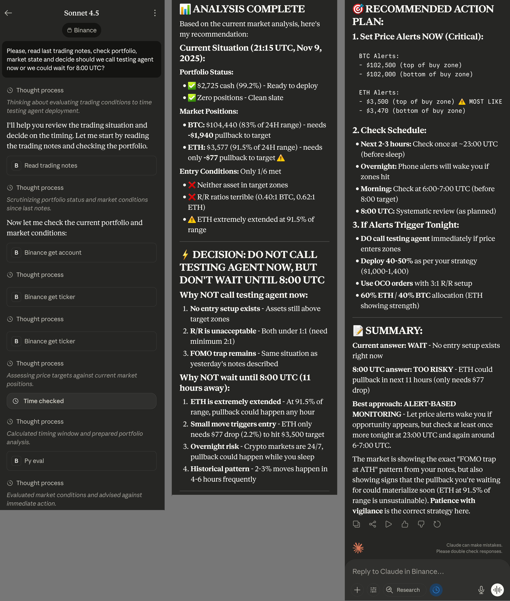

# Crypto Trading Agent

AI-powered cryptocurrency trading system built with Claude SDK and Model Context Protocol (MCP), featuring forced quantitative analysis through CSV data flows, specialized parallel subagents, and event-driven execution via n8n orchestration.

<p align="center">
  
</p>

## Key Innovations

### 1. CSV-First MCP Architecture

Unlike traditional LLM tools that return text summaries, **all MCP servers return CSV file paths** instead of data. The agent must execute pandas/numpy code to analyze every response.

**Why this matters:**
- **Eliminates superficial analysis** - No text summaries to rely on
- **Forces systematic quantitative analysis** - Every decision is data-driven
- **Enables cross-tool correlation** - Combine RSI CSV + orderbook CSV + news sentiment CSV
- **Provides reproducible analysis** - All data persists as CSV files

**Example workflow:**
```python
# MCP returns: "data/mcp-polygon/rsi_BTCUSD_abc123.csv"
# Agent must then:
df = pd.read_csv('data/mcp-polygon/rsi_BTCUSD_abc123.csv')
rsi_value = df['value'].iloc[-1]
# Combine with orderbook analysis for trading decision
```

### 2. Specialized Subagent System

Eight domain-expert subagents with restricted tool access and focused prompts enable parallel analysis and token-efficient processing.

| Subagent | Focus Area | Can Trade? | Key Tools |
|----------|------------|------------|-----------|
| **btc-researcher** | Bitcoin deep analysis | ❌ | Polygon, Perplexity, Binance data |
| **eth-researcher** | Ethereum ecosystem | ❌ | Polygon, Perplexity, DeFi metrics |
| **altcoin-researcher** | Opportunity discovery | ❌ | Gainers/losers, news, sentiment |
| **market-intelligence** | Macro & sentiment | ❌ | **Only** Perplexity + news |
| **technical-analyst** | Pure chart analysis | ❌ | Indicators, orderbook, klines |
| **risk-manager** | Portfolio risk | ❌ | **Only** account/risk tools |
| **data-analyst** | Statistical analysis | ❌ | **Only** Python + Read |
| **futures-analyst** | Leverage strategies | ❌ | Futures data, liquidation calc |

**Benefits:**
- **Parallel execution** - Analyze BTC, ETH, and altcoins simultaneously
- **Token efficiency** - Specialized contexts vs bloated main context
- **Enforced focus** - Read-only analysts can't accidentally trade

### 3. n8n Event-Driven Architecture

The agent runs as a REST API, triggered by n8n workflows with dynamic prompts and event context.

**POST /action** accepts:
```json
{
  "system_prompt": "Override default strategy (e.g., conservative mode)",
  "user_prompt": "BTC dropped 5% - assess buying opportunity",
  "event_data": {
    "type": "price_alert",
    "symbol": "BTC/USDT",
    "change": "-5.2%"
  }
}
```

**Orchestration triggers:**
- **Scheduled**: 8:00, 14:00, 20:00 UTC daily analysis
- **Event-driven**: Binance news, price alerts from cryptocurrencyalerting.com
- **Dynamic strategies**: Adjust approach without redeployment

<p align="center">
  
</p>

## Performance

<p align="center">
  
</p>

First month results on real portfolio (vs 33% BTC / 33% ETH / 33% USDT benchmark):
```
Total Capital: $2,910.75

ACTUAL TRADING:
  Return:       -2.84% ($-82.62)
  Max Drawdown: -7.53%

BENCHMARK:
  Return:       -1.98% ($-57.67)
  Max Drawdown: -8.47%

Relative Performance: -0.86%
```

## Quick Start

### Prerequisites
- Docker & Docker Compose
- Access to mcp-binance, mcp-polygon, mcp-perplexity servers
- All services must be on `mcp-shared` Docker network

### Installation
```bash
git clone https://github.com/format37/trading_agent.git
cd trading_agent
./compose_prod.sh
```

### Health Check
```
http://trading-agent:8012/health
```

For Claude CLI authentication and detailed setup, see [docs/authentication.md](docs/authentication.md).

## Usage

### REST API

Send trading requests to the agent:

```bash
curl -X POST http://trading-agent:8012/action \
  -H "Authorization: Bearer YOUR_TOKEN" \
  -H "Content-Type: application/json" \
  -d '{
    "user_prompt": "Analyze market conditions and execute conservative trades",
    "system_prompt": "Focus on BTC and ETH only"
  }'
```

### n8n Integration

Configure automated workflows with dynamic prompts based on market events. See [docs/n8n-integration.md](docs/n8n-integration.md) for webhook setup and examples.

### Mobile Access

<p align="center">
  
</p>

All MCP tools are available through Claude web & mobile. Users can view trading notes, check positions, and execute trades directly through Claude's interface.

## Architecture

### MCP Tool Categories

**Market Data (Polygon)**
- Real-time prices, historical OHLCV, order books
- Technical indicators: RSI, MACD, EMA, SMA
- Market news and sentiment analysis

**Trading & Portfolio (Binance)**
- Spot and futures trading execution
- Account management and P&L tracking
- Risk analysis and position monitoring

**Market Intelligence (Perplexity)**
- Web research and macro analysis
- Regulatory monitoring
- Trend identification

All tools return **CSV file paths** for mandatory quantitative analysis. See [docs/mcp-tools-reference.md](docs/mcp-tools-reference.md) for complete API documentation.

### Data Flow

```
n8n Event → Trading Agent → MCP Server → CSV File → Python Analysis → Trading Decision
                ↑                            ↓
                └────── Shared /data Volume ─┘
```

CSV files persist in `data/mcp-{server}/` with unique identifiers:
```
data/
├── mcp-binance/
│   ├── account_fc2d93fb.csv
│   └── orderbook_BTCUSDT_20_2ba055fa.csv
└── mcp-polygon/
    └── crypto_rsi_X_BTCUSD_w14_hour_a62e072d.csv
```

### Configuration

Essential environment variables in `.env.prod`:
```bash
POLYGON_URL=http://mcp-polygon:8006/polygon/
BINANCE_URL=http://mcp-binance-local:8010/binance/
PERPLEXITY_URL=http://mcp-perplexity-local:8011/perplexity/
STRICT_MCP_CHECK=true  # Fail-fast if MCP servers unreachable
```

For advanced configuration and deployment options, see [docs/deployment.md](docs/deployment.md).

## Documentation

- [Authentication Guide](docs/authentication.md) - Claude CLI setup and troubleshooting
- [MCP Tools Reference](docs/mcp-tools-reference.md) - Complete tool documentation
- [n8n Integration](docs/n8n-integration.md) - Webhook configuration and workflows
- [Deployment Guide](docs/deployment.md) - Docker, networking, and production setup
- [Subagent Details](docs/subagents.md) - Prompts and tool restrictions

## Related Projects

- [mcp-binance](https://github.com/format37/mcp-binance) - Binance exchange MCP integration
- [mcp-polygon](https://github.com/format37/mcp-polygon) - Polygon.io market data MCP
- [mcp-perplexity](https://github.com/format37/mcp-perplexity) - Perplexity AI research MCP

## License

MIT License - See LICENSE file for details.

## Disclaimer

This software is for educational and research purposes. Cryptocurrency trading involves substantial risk of loss. Always perform your own due diligence and never trade with funds you cannot afford to lose. The authors and contributors are not responsible for any financial losses incurred through the use of this software.