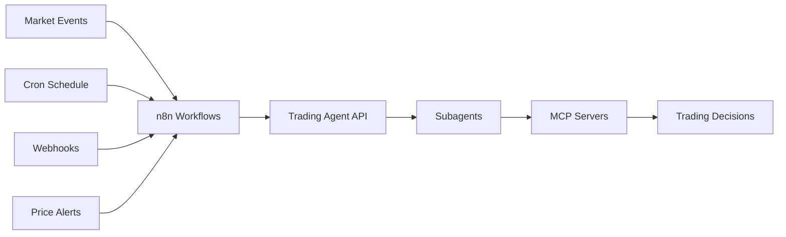

# n8n Integration Guide

Complete guide for integrating the Trading Agent with n8n workflow automation platform for event-driven trading execution.

## Overview

n8n enables sophisticated event-driven trading by:
- Triggering analysis based on market events
- Customizing prompts per event type
- Orchestrating complex trading workflows
- Managing execution schedules

## Architecture



## Setting Up n8n

### Installation

Deploy n8n using Docker:

```bash
docker run -d \
  --name n8n \
  --network mcp-shared \
  -p 5678:5678 \
  -v n8n_data:/home/node/.n8n \
  n8nio/n8n
```

Access n8n at: `http://localhost:5678`

## Creating Trading Workflows

### Basic HTTP Request Node

1. **Add HTTP Request Node**
   - Method: `POST`
   - URL: `http://trading-agent:8012/action`

2. **Configure Authentication**
   - Type: Header Auth
   - Header Name: `Authorization`
   - Header Value: `Bearer YOUR_TOKEN`

3. **Set Request Body**
   ```json
   {
     "system_prompt": "Conservative trading mode with max 2% per position",
     "user_prompt": "Analyze current market and execute if opportunities exist",
     "event_data": {
       "trigger": "scheduled",
       "timestamp": "{{$now}}"
     }
   }
   ```

## Event Triggers

### 1. Scheduled Analysis (Cron)

**Three times daily market analysis:**

```yaml
Trigger: Cron
Expression: 0 8,14,20 * * *
Timezone: UTC
```

**Workflow JSON:**
```json
{
  "nodes": [
    {
      "name": "Cron",
      "type": "n8n-nodes-base.cron",
      "parameters": {
        "cronExpression": "0 8,14,20 * * *"
      }
    },
    {
      "name": "Trading Analysis",
      "type": "n8n-nodes-base.httpRequest",
      "parameters": {
        "method": "POST",
        "url": "http://trading-agent:8012/action",
        "bodyParametersJson": {
          "user_prompt": "Perform scheduled market analysis",
          "system_prompt": "Standard risk parameters"
        }
      }
    }
  ]
}
```

### 2. Binance News Webhook

**React to exchange announcements:**

1. **Create Webhook Node:**
   ```yaml
   Type: Webhook
   HTTP Method: POST
   Path: /binance-news
   Response Mode: Immediately
   ```

2. **Process News Event:**
   ```javascript
   // Function node to parse Binance news
   const newsType = $input.first().json.type;
   const symbol = $input.first().json.symbol;

   let prompt = "";
   switch(newsType) {
     case "new_listing":
       prompt = `New listing alert: ${symbol}. Analyze for early opportunity.`;
       break;
     case "delisting":
       prompt = `Delisting warning: ${symbol}. Check positions and exit if needed.`;
       break;
     case "maintenance":
       prompt = `Maintenance notice: ${symbol}. Verify open orders.`;
       break;
   }

   return {
     user_prompt: prompt,
     system_prompt: "Priority: Risk management for news events",
     event_data: $input.first().json
   };
   ```

3. **Send to Trading Agent:**
   ```yaml
   HTTP Request:
     Method: POST
     URL: http://trading-agent:8012/action
     Body: {{$json}}
   ```

### 3. Price Alert Integration

**cryptocurrencyalerting.com webhook:**

1. **Webhook Configuration:**
   ```yaml
   Webhook URL: https://your-n8n.com/webhook/crypto-alerts
   Method: POST
   ```

2. **Alert Processing Workflow:**
   ```javascript
   // Parse alert data
   const alert = $input.first().json;

   // Determine action based on alert type
   let action = {};

   if (alert.price_change_percent < -5) {
     action = {
       user_prompt: `${alert.symbol} dropped ${alert.price_change_percent}%. Analyze for buying opportunity.`,
       system_prompt: "Focus on oversold conditions and support levels",
       event_data: alert
     };
   } else if (alert.price_change_percent > 10) {
     action = {
       user_prompt: `${alert.symbol} surged ${alert.price_change_percent}%. Consider taking profits.`,
       system_prompt: "Evaluate overbought conditions",
       event_data: alert
     };
   } else if (alert.volume_spike) {
     action = {
       user_prompt: `Unusual volume on ${alert.symbol}. Investigate for potential breakout.`,
       system_prompt: "Analyze volume patterns and momentum",
       event_data: alert
     };
   }

   return action;
   ```

## Advanced Workflows

### Multi-Step Analysis with Conditions

```json
{
  "name": "Advanced Trading Workflow",
  "nodes": [
    {
      "name": "Market Check",
      "type": "n8n-nodes-base.httpRequest",
      "parameters": {
        "url": "http://trading-agent:8012/action",
        "bodyParametersJson": {
          "user_prompt": "Quick market assessment - volatility check only",
          "system_prompt": "Report only, no trades"
        }
      }
    },
    {
      "name": "Volatility Check",
      "type": "n8n-nodes-base.if",
      "parameters": {
        "conditions": {
          "string": {
            "value1": "={{$json.analysis.volatility}}",
            "operation": "contains",
            "value2": "high"
          }
        }
      }
    },
    {
      "name": "Conservative Mode",
      "type": "n8n-nodes-base.httpRequest",
      "parameters": {
        "url": "http://trading-agent:8012/action",
        "bodyParametersJson": {
          "user_prompt": "High volatility detected. Execute defensive strategy.",
          "system_prompt": "Maximum position size: 1%. Prefer stablecoins."
        }
      }
    },
    {
      "name": "Aggressive Mode",
      "type": "n8n-nodes-base.httpRequest",
      "parameters": {
        "url": "http://trading-agent:8012/action",
        "bodyParametersJson": {
          "user_prompt": "Low volatility environment. Look for breakout setups.",
          "system_prompt": "Standard risk parameters. Focus on momentum plays."
        }
      }
    }
  ]
}
```

### Parallel Asset Analysis

```javascript
// Split node to analyze multiple assets simultaneously
const assets = ['BTC', 'ETH', 'SOL', 'AVAX'];

return assets.map(symbol => ({
  json: {
    user_prompt: `Analyze ${symbol}/USDT for trading opportunities`,
    system_prompt: "Quick assessment, delegate to specialized subagent",
    event_data: { symbol: `${symbol}/USDT` }
  }
}));
```

## Dynamic Prompt Templates

### Event-Based Prompts

```javascript
// Function node for dynamic prompts
const hour = new Date().getHours();
const dayOfWeek = new Date().getDay();

let systemPrompt = "";
let userPrompt = "";

// Time-based strategy
if (hour >= 0 && hour < 8) {
  systemPrompt = "Asian session - focus on BTC, ETH, Asian tokens";
  userPrompt = "Analyze Asian market activity";
} else if (hour >= 8 && hour < 16) {
  systemPrompt = "European session - monitor regulatory news";
  userPrompt = "Check European market sentiment";
} else {
  systemPrompt = "US session - watch for institutional moves";
  userPrompt = "Analyze US market indicators";
}

// Weekend adjustments
if (dayOfWeek === 0 || dayOfWeek === 6) {
  systemPrompt += ". Weekend - reduced liquidity, wider spreads expected";
}

return {
  system_prompt: systemPrompt,
  user_prompt: userPrompt,
  event_data: {
    session: hour < 8 ? "asia" : hour < 16 ? "europe" : "us",
    is_weekend: dayOfWeek === 0 || dayOfWeek === 6
  }
};
```

### Market Condition Adaptations

```javascript
// Adapt strategy based on market conditions
const btcPrice = $item(0).$node["Get BTC Price"].json.price;
const btc24hChange = $item(0).$node["Get BTC Price"].json.change_24h;

let strategy = {};

if (Math.abs(btc24hChange) > 10) {
  // Extreme volatility
  strategy = {
    system_prompt: "EXTREME VOLATILITY MODE: Reduce all position sizes by 50%. No leverage.",
    user_prompt: "Market experiencing extreme moves. Focus on risk management."
  };
} else if (btc24hChange < -5) {
  // Bear mode
  strategy = {
    system_prompt: "Bear market conditions. Prioritize capital preservation.",
    user_prompt: "Market declining. Look for oversold bounces or stay in stables."
  };
} else if (btc24hChange > 5) {
  // Bull mode
  strategy = {
    system_prompt: "Bull market conditions. Can be more aggressive with entries.",
    user_prompt: "Market rallying. Look for momentum continuations."
  };
} else {
  // Neutral
  strategy = {
    system_prompt: "Neutral market. Standard parameters.",
    user_prompt: "Sideways action. Look for range trades."
  };
}

return strategy;
```

## Error Handling

### Retry Logic

```json
{
  "name": "HTTP Request with Retry",
  "type": "n8n-nodes-base.httpRequest",
  "parameters": {
    "options": {
      "timeout": 30000,
      "retry": {
        "maxTries": 3,
        "waitBetweenTries": 5000,
        "onError": "continueErrorOutput"
      }
    }
  }
}
```

### Error Notifications

```javascript
// Error handler node
if ($input.first().error) {
  // Send notification
  return {
    message: `Trading Agent Error: ${$input.first().error.message}`,
    severity: "high",
    timestamp: new Date().toISOString(),
    workflow: $workflow.name,
    should_alert: true
  };
}
```

## Monitoring and Logging

### Execution Logging

```javascript
// Log all executions to database
const execution = {
  workflow: $workflow.name,
  execution_id: $execution.id,
  timestamp: new Date().toISOString(),
  trigger: $input.first().json.event_data?.trigger || 'manual',
  prompt: $input.first().json.user_prompt,
  response: $item.$node["Trading Agent"].json
};

// Store in database or send to monitoring service
return execution;
```

### Performance Metrics

```javascript
// Track execution times and success rates
const startTime = $item.$node["Start"].json.timestamp;
const endTime = new Date().toISOString();
const duration = new Date(endTime) - new Date(startTime);

return {
  metrics: {
    duration_ms: duration,
    success: !$input.first().error,
    positions_opened: $item.$node["Trading Agent"].json.positions_opened || 0,
    positions_closed: $item.$node["Trading Agent"].json.positions_closed || 0
  }
};
```

## Best Practices

### 1. Workflow Organization

```
n8n-workflows/
├── triggers/
│   ├── scheduled-analysis.json
│   ├── price-alerts.json
│   └── news-events.json
├── strategies/
│   ├── conservative.json
│   ├── aggressive.json
│   └── market-neutral.json
├── utilities/
│   ├── error-handler.json
│   └── notification.json
└── main-orchestrator.json
```

### 2. Security

- **Never hardcode API tokens** - Use n8n credentials
- **Validate webhook sources** - Check signatures/IPs
- **Rate limit external webhooks** - Prevent abuse
- **Use HTTPS in production** - Encrypt webhook traffic

### 3. Testing

**Test workflow before production:**
```javascript
// Add test mode flag
const isTest = $input.first().json.test_mode || false;

return {
  user_prompt: isTest ?
    "TEST MODE: Analyze only, no real trades" :
    "Execute normal trading strategy",
  system_prompt: isTest ?
    "This is a test. Report what you would do but don't execute" :
    "Normal trading parameters"
};
```

### 4. Backup

Export workflows regularly:
```bash
# Export all workflows
n8n export:workflow --all --output=./backups/

# Export specific workflow
n8n export:workflow --id=3 --output=./backups/
```

## Troubleshooting

### Common Issues

**Agent not responding:**
```javascript
// Add health check before main request
const healthCheck = await $http.get('http://trading-agent:8012/health');
if (healthCheck.status !== 200) {
  throw new Error('Trading agent is not healthy');
}
```

**Timeout errors:**
- Increase timeout in HTTP Request node (30-60 seconds)
- Consider breaking complex analyses into steps
- Use queue mode for long-running analyses

**Authentication failures:**
- Verify token in n8n credentials
- Check token expiration
- Ensure header format: `Bearer TOKEN`

## Example Complete Workflow

Here's a production-ready workflow combining multiple concepts:

```json
{
  "name": "Production Trading Orchestrator",
  "nodes": [
    {
      "name": "Multi-Trigger",
      "type": "n8n-nodes-base.merge",
      "inputs": ["Cron", "Webhook", "Manual"]
    },
    {
      "name": "Determine Strategy",
      "type": "n8n-nodes-base.function",
      "code": "// Complex logic to determine strategy based on trigger type"
    },
    {
      "name": "Pre-flight Checks",
      "type": "n8n-nodes-base.httpRequest",
      "description": "Check agent health and MCP status"
    },
    {
      "name": "Execute Trading",
      "type": "n8n-nodes-base.httpRequest",
      "description": "Main trading execution"
    },
    {
      "name": "Post-Analysis",
      "type": "n8n-nodes-base.function",
      "description": "Log results and calculate metrics"
    },
    {
      "name": "Notifications",
      "type": "n8n-nodes-base.if",
      "description": "Send alerts if needed"
    }
  ]
}
```

This workflow provides:
- Multiple trigger sources
- Dynamic strategy selection
- Health checking
- Execution with retry
- Logging and metrics
- Conditional notifications